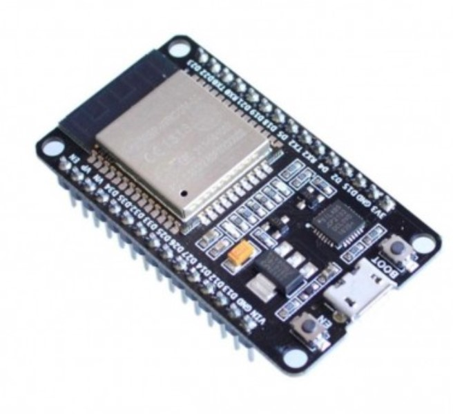
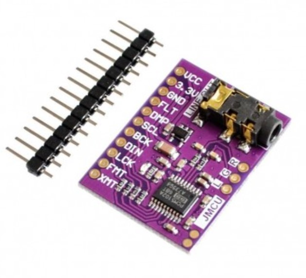
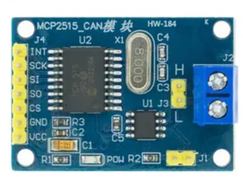

# Bluetooth Saab

Requires ESP-IDF v4.4.3, ESP32-A2DP does not work out of the box with 5.0.0

## ESP32
Built using ESP32-WROOM-32 Devkit

Chip is ESP32-D0WD-V3 (revision 3)

## Wiring

### PCM1502A module

| From | To  |
| ---- | --- |
| VCC  | 5v  |
| 3.3V | N/C |
| GND  | GND |
| FLT  | GND |
| DMP  | GND |
| SCL  | N/C |
| BCK  | 26  |
| DIN  | 22  |
| LCK  | 25  |
| FMT  | GND |
| XMT  | 32  |

## MCP2515

| From | To  |
| ---- | --- |
| VCC  | 5v  |
| GND  | GND |
| CS   | 5   |
| SO   | 19 with r4.7k |
| SI   | 23  |
| SCK  | 18  |
| INT  | 34 with r4.7k |
